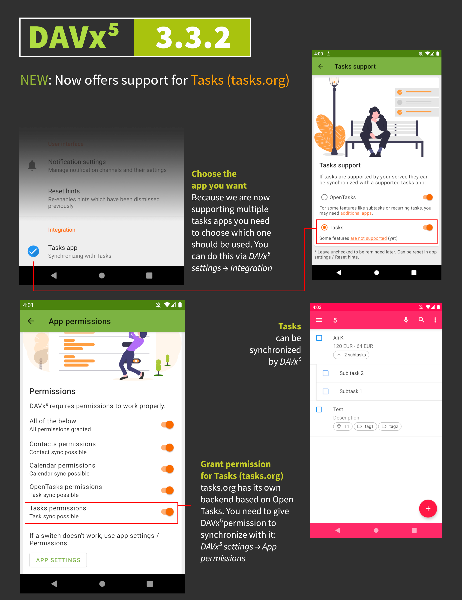

[DAVx⁵](https://play.google.com/store/apps/details?id=at.bitfire.davdroid) can
be used to synchronize your CalDAV data with Tasks

### DAVx⁵ vs CalDAV

Both options provide nearly identical functionality, with the exception that
Tasks cannot create, rename, colorize, or delete your CalDAV lists when
synchronizing with DAVx⁵.

Tasks will ignore your DAVx⁵ data if you have set up CalDAV synchronization for
the same account.

### Adding an account

Your data will automatically appear in Tasks after setting up DAVx⁵. Refer to
the following DAVx⁵ infographic for setup instructions.

### Troubleshooting

Make sure DAVx⁵ integration is configured properly

1. Open the DAVx⁵ app
2. Tap `☰ > Settings`
    * Make sure `App permissions > Tasks permissions` is toggled on
    * Make sure `Integration > Tasks app > Tasks` is checked

Make sure at least one task list is synchronized

1. Open the DAVx⁵ app
2. Tap on your account
3. Tap on the `CALDAV` tab
4. Tap `⋮ > Refresh calendar list`
5. Check at least one task list
6. Tap on `🗘` to initiate synchronization

